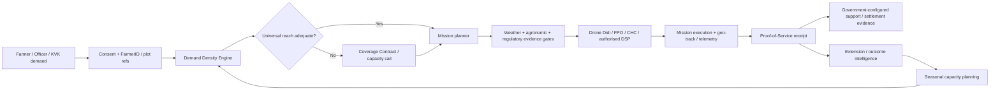
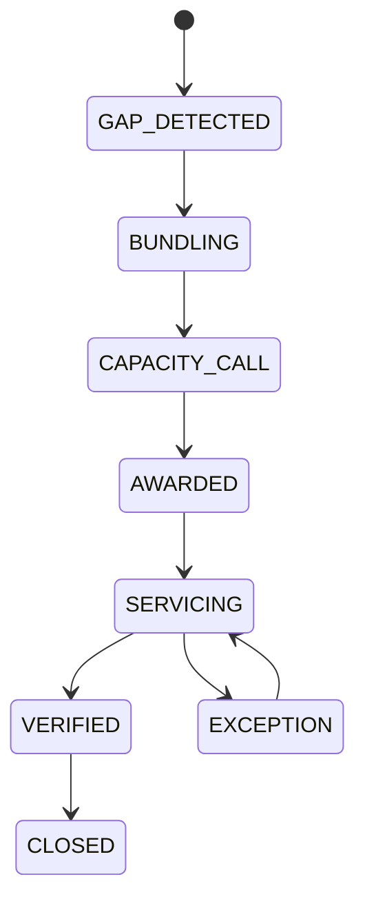
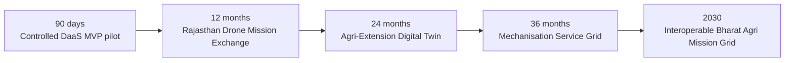

<div align="center">

# RAJ-KRISHI DRONE GRID

### **MVP PROTOTYPE · Drone-as-a-Service Platform for Universal Agri-Extension Reach**

**Rajasthan Innovation Challenge 2026 · Agriculture**  
**Syntheon Tech Private Limited**

> **A drone does not become agricultural infrastructure because it was purchased. It becomes infrastructure when an eligible farmer can reliably access a compliant, affordable and verifiable service from it.**

</div>

---

## 60-second decision memo

Rajasthan does **not** need another isolated “book a drone” marketplace. Public and regulated building blocks already exist: RajKisan and assisted state channels, AgriStack/State Farmer Registry, FARMS/CHCs, NaMo Drone Didi, KVKs, DGCA eGCA/Digital Sky workflows, IMD and Government finance rails.

The unresolved problem is **statewide service orchestration**:

**Where is demand? → can it be pooled? → is compliant capacity available? → can a remote block be served economically? → is the mission safe and agronomically valid? → did the service actually happen? → what evidence supports payment/support? → what capacity must be trained before the next crop window?**

**RAJ-KRISHI DRONE GRID is an MVP prototype of that missing execution layer.** It federates authoritative systems; it does not replace them.

> **MVP status:** functional submission demonstrator with synthetic mission/finance data, a live public IMD gateway, explicit Government-system adapters, simulated SSO/Jan Aadhaar access journeys, interactive GIS, guided evaluator flow and deployment-ready Next.js/Vercel configuration. It is **not** an official Government production system and leaves room for Department customisation, security accreditation, authorised API access and field-pilot configuration.

---

# Problem statement → product response

| Challenge issue | What fails operationally | MVP response | Pilot measure |
|---|---|---|---|
| Remote / tribal coverage | Marketplace demand is too sparse to attract a provider | **Universal Reach Index + Coverage Contract Engine** | underserved-block serviceability before/after |
| High ₹/hectare for smallholders | One small plot creates dead kilometres and poor utilisation | **Demand Density Engine** | mobilisation ₹/acre vs unclustered comparator |
| RPC shortage | Training happens without seasonal demand intelligence | **Seasonal Capacity Digital Twin + KVK→RPTO pipeline** | forecast vs actual pilot-hour gap |
| Fragmented regulatory workflow | UIN/RPC/airspace/agronomic evidence sits in separate systems | **Mission Compliance Passport** | pre-dispatch evidence completeness |
| Service-fee support / DBT | Invoice ≠ proof that an acre-service occurred | **Proof-of-Service Receipt** | evidence completeness + settlement exceptions |
| Department/KVK integration | Drones remain standalone spray assets | **Extension Campaign Command** | signal-to-scout / response time |
| Weak rural connectivity | Field intake and acknowledgement can fail | **Optional SUTRA ID Edge** | offline queue success + sync reconciliation |
| No statewide utilisation view | Asset count is mistaken for service capacity | **State Command + Reach/Capacity analytics** | productive acres / provider / month |

---

# The state operating loop



### Product principle

**Authoritative registries remain source-owned. The Grid owns service orchestration, evidence and measurable reach.**

---

# What is actually functional in the MVP

### 1. Government-style access shell
- **Evaluator access** with role selection.
- **Government SSO visual simulation** using dummy credentials.
- **Jan Aadhaar-assisted farmer visual simulation** using a masked demo family reference.
- Persistent **MVP PROTOTYPE** labelling.
- Explicit warning: **no live Rajasthan SSO / Jan Aadhaar authentication occurs**.

This mirrors familiar RajKisan access semantics without fabricating privileged access.

### 2. State Drone Command Centre
- Rajasthan GIS / OpenStreetMap mission visualisation.
- Selectable mission markers aligned with command records.
- Separate, non-selectable **coverage-gap markers** for illustrative underserved blocks.
- Demand, reach, mission, service-cost and evidence analytics.
- Synthetic operational figures clearly separated from sourced public facts.

### 3. Demand Density Engine
Hard compatibility rules run before optimisation:

`plot proximity + crop/stage + service/input + requested window + weather + drone capability + rule pack + service economics`

Evaluator journey: **67 fragmented demo requests → 9 executable demo missions**.

The ₹486/ac → ₹329/ac values are an **illustrative scenario, not a measured Rajasthan saving**. The pilot is designed to measure the comparator.

### 4. Universal Service Coverage Engine
A marketplace can report “no provider available”. Government needs an instrument to close the gap.



A coverage bundle can combine eligible acreage, provider capacity, SLA, logistics and **Department-configured** viability support. Demo support values are illustrative; the product does not invent subsidy authority.

### 5. Mission Compliance + Agronomic Application Passport
Each mission can carry:
- farmer consent + plot context;
- drone UIN reference;
- RPC reference;
- service/crop rule pack;
- IMD weather evidence;
- airspace / regulatory evidence reference;
- provider declaration;
- application/input traceability where applicable;
- geo-track / telemetry;
- farmer acknowledgement.

**AI may explain a rule. It cannot waive it.**

### 6. Proof-of-Service + DBT evidence
The atomic public-value unit is **verified acre-service**, not “booking” or “invoice”.

`MISSION_COMPLETE → EVIDENCE_VERIFIED → POLICY_ELIGIBLE → SETTLEMENT_READY`

Government finance systems remain the settlement authority.

### 7. Seasonal Capacity Digital Twin
Forecast crop/service demand against:

`active drones + payload capability + RPC hours + batteries + charging + transport + maintenance + weather-adjusted productive hours`

The output is operational: **train pilots, stage batteries, create a transport hub, call external capacity or reserve available fleet**.

### 8. Agri-Extension Campaign Command
The MVP includes a separate extension surface:

`signal → scouting mission → human/agronomic review → authorised action → follow-up → closure`

This makes drones useful for crop-health scouting, pest surveillance, mapping, damage assessment, demonstrations and verified follow-up — not only spraying.

### 9. Programme & Finance module
A dedicated Government programme view includes:
- 90-day joint-pilot compact;
- scheme-convergence boundaries;
- public-value / SLA logic;
- Syntheon institutional revenue model;
- outcomes for farmers, providers, Drone Didis/FPOs/CHCs, officers, KVKs and trainees.

### 10. Live IMD public gateway
The server-side `/api/imd` route tests the official public district-nowcast gateway and degrades gracefully. This is the only external Government feed intentionally labelled `LIVE_PUBLIC` in the MVP.

---

# Government infrastructure we enhance — not replace

| Rail | Existing authority / role | RAJ-KRISHI role | MVP status |
|---|---|---|---|
| **RajKisan / SSO / Jan Aadhaar / e-Mitra** | State service access / identity-assisted journeys | familiar entry / assisted-service adapter | `DEMO_ONLY / ADAPTER_READY` |
| **AgriStack / UFSI** | Farmer / farmland plot / crop registries with consent architecture | service references, no parallel farmer master | `CONTRACT_DEFINED` |
| **DGCA eGCA / Digital Sky** | UIN, RPC/RPTO and regulatory / airspace workflows | evidence adapter / state machine | `AUTH_REQUIRED` |
| **IMD** | official weather / warnings / nowcast | mission weather context | `LIVE_PUBLIC` |
| **FARMS / CHC** | machinery / custom-hiring capacity | provider-capacity federation | `FEDERATION_READY` |
| **NaMo Drone Didi MIS** | programme asset / pilot / utilisation monitoring | cross-provider demand / mission federation | `FEDERATION_READY` |
| **KVK / DGCA-authorised RPTO** | extension / agronomic support / regulated training | gap-led capacity pipeline | `WORKFLOW_DEFINED` |
| **DBT / State treasury** | public-money authority | evidence / reconciliation package | `SIMULATED` |
| **SUTRA ID Edge** | optional Syntheon last-mile node | offline voice / consent / acknowledgement | `OPTIONAL_EDGE` |
| **FarmGraph** | optional Syntheon intelligence | need prioritisation / follow-up | `OPTIONAL_AI` |

**Nothing privileged is represented as live without credentials and authorisation.**

---

# Why the policy timing is strong

Current public policy signals reinforce an orchestration-first approach:

- Rajasthan has **87,23,010 Farmer IDs** reported as of **20 July 2026**, making a federated farmer/plot reference model increasingly practical.
- ICAR lists **47 KVKs in Rajasthan**, creating a natural extension / training mesh.
- PIB reported **40 Rajasthan SHGs** in the relevant NaMo Drone Didi drone-distribution / pilot-training table as of January 2026. This is a scheme baseline, **not** Rajasthan's total drone fleet.
- NaMo Drone Didi operating guidelines expect States to help selected SHGs generate sufficient business to cover roughly **2,000–2,500 acres annually** and already include an IT Drone Portal for programme MIS — strengthening the need for demand-density and multi-provider utilisation rather than another scheme MIS.
- DGCA migrated UIN and fresh RPC services from Digital Sky to **eGCA from July 2025**.
- The **11 August 2026** national farm-mechanisation update reiterates SMAM's focus on small/marginal farmers and low-mechanisation regions, supports CHCs and encourages precision agriculture / drones — directly aligned with a service-grid model.

Primary-source register: [`docs/RESEARCH_EVIDENCE_REGISTER.md`](docs/RESEARCH_EVIDENCE_REGISTER.md)

---

# Scheme convergence — disciplined, not opportunistic

The MVP distinguishes **existing scheme authority** from **proposed pilot convergence**.

| Programme / rail | Existing relevance | What we propose | What we do **not** assume |
|---|---|---|---|
| SMAM / RKVY mechanisation | CHCs, demonstrations, mechanisation support | integrate eligible providers / assets and measure utilisation | that any current asset subsidy can automatically fund our service-fee pilot |
| NaMo Drone Didi | women-led drone service capacity + scheme MIS | route suitable pooled demand to eligible capacity subject to approval | ownership of Drone Didi MIS / programme authority |
| AgriStack | farmer / plot / crop DPI | consented reference layer | copying the state registry into our own master |
| RajKisan / Jan Aadhaar / SSO | citizen and departmental rails | assisted intake / identity handoff | live authentication without Government credentials |
| KVK / RPTO | extension + training | forecast-led candidate / capacity pipeline | issuing RPC ourselves |
| IMD / eGCA / Digital Sky | weather + regulatory workflows | evidence adapters | autonomous flight authorisation |

Detailed matrix: [`docs/SCHEME_CONVERGENCE_AND_PUBLIC_VALUE.md`](docs/SCHEME_CONVERGENCE_AND_PUBLIC_VALUE.md)

---

# Joint 90-day pilot

### Proposed operating compact

| Participant | Proposed pilot responsibility |
|---|---|
| **Department of Agriculture, Rajasthan** | policy authority, pilot geography, credentials, approvals, acceptance, scale decision |
| **Syntheon** | MVP platform, GIS, adapters, orchestration, evidence, security/UAT, PMO, training and handover |
| **KVK / extension network** | agronomic validation, mobilisation, campaign workflow, demonstrations, trainee funnel |
| **DGCA-authorised RPTO** | RPC training/certification pathway |
| **Drone Didi / FPO / CHC / authorised private DSP** | fleet, licensed operator, maintenance, mission execution, telemetry |
| **e-Mitra / optional SUTRA-assisted field channel** | assisted access and weak-connectivity continuity where approved |

These are **proposed roles, not claimed partnerships**.

### Phase 1 · Days 0–30
Authority matrix, approved data contracts, provider/RPC onboarding, live IMD, rule packs, Demand Density, Reach Index, end-to-end sandbox mission.

### Phase 2 · Days 31–60
Controlled authorised field missions, provider workflow, assisted farmer journey, proof-of-service, exception/grievance flow, settlement evidence, optional SUTRA offline test.

### Phase 3 · Days 61–90
Measured economics, reach improvement, provider/Drone Didi utilisation, RPC/logistics forecast, security review, acceptance report and state-scale implementation plan.

Pilot acceptance plan: [`docs/PILOT_ACCEPTANCE_PLAN.md`](docs/PILOT_ACCEPTANCE_PLAN.md)

---

# Indicative financial proposal

## **₹74.80 lakh · 90-day controlled pilot · ₹0 core drone procurement**

The pilot buys the missing **state service capability**, not another fleet:

- product + GIS + orchestration;
- demand-density and universal-coverage engines;
- approved adapters / data contracts;
- compliance and agronomic rule packs;
- provider / officer / field workflows;
- proof-of-service and audit;
- security, privacy, observability and UAT;
- pilot operations, training, PMO and handover;
- measured statewide scale plan.

**Primary public-value unit:** `₹ / verified acre-service`.

---

# Sustainable service / revenue model

Syntheon's proposed model is Government/institutional — **not farmer-data monetisation and not a mandatory farmer subscription**.

1. **Implementation & integration** — one-time configuration, GIS, approved adapters, security/UAT, policy/rule packs and onboarding.
2. **Managed platform / O&M** — annual hosting, SLA support, observability, security, upgrades, analytics and training.
3. **Verified-service orchestration** — optional procurement-permitted fee linked to verified mission volume/SLA, where Government chooses this commercial structure.
4. **Optional field edge / enablement** — SUTRA nodes, device management and field support only where operational conditions justify them.
5. **State-to-state deployment** — UFSI-compatible configurations without creating a proprietary national farmer database.

Commercial detail: [`docs/COMMERCIAL_AND_SCALE_MODEL.md`](docs/COMMERCIAL_AND_SCALE_MODEL.md)

---

# Future vision — from drone pilot to physical agri-service grid



The architecture can later extend — subject to Government priorities — from drone scouting/application to selected CHC machinery, sensing, mapping, soil/testing and other **verified physical agricultural services**. The 11 Aug 2026 mechanisation update makes this broader CHC/service-grid direction especially timely.

---

# SUTRA ID Edge — use only where it creates public value

Optional field node for low-connectivity / assisted journeys:

```text
voice / Hindi-assisted intake
        ↓
masked FarmerID / plot reference
        ↓
consent + mission request
        ↓
offline mission cache / field evidence
        ↓
farmer acknowledgement
        ↓
encrypted store-and-forward sync
```

**SUTRA is not required for the central Grid and never becomes identity/regulatory authority.**

---

# Security, privacy and authority model

- minimum mission-required data;
- references to source registries rather than unnecessary copies;
- role-based access and purpose limitation;
- versioned rule / policy packs;
- auditable state transitions;
- evidence hashes / append-only event posture;
- external authorities remain authoritative;
- no Aadhaar or Jan Aadhaar values are required in the evaluator demo;
- Vercel security headers + India-region function preference prepared;
- production deployment still requires Department security, privacy and API approval.

Authority matrix: [`docs/GOVERNANCE_AUTHORITY_MATRIX.md`](docs/GOVERNANCE_AUTHORITY_MATRIX.md)

---

# Guided evaluator demo · ~3 minutes

1. Open **Evaluator Access** on the MVP login screen.
2. Enter **Operations** and start **Run Judge Journey**.
3. Demonstrate `67 requests → 9 missions`.
4. Open **Universal Reach** and show how a remote-block gap becomes a service-capacity problem Government can close.
5. Open **Mission Control** and inspect regulatory + agronomic gates.
6. Open **Evidence & DBT** and show why invoice ≠ proof-of-service.
7. Open **Fleet & RPC Capacity** and show gap-led training/logistics.
8. Open **Extension Campaigns** from the top module switcher.
9. Open **Programme & Finance** to show joint pilot, scheme convergence and sustainable Government service model.
10. Open **Government Integration Fabric** and end on truthful authority boundaries.

Full runbook: [`docs/JUDGE_DEMO_RUNBOOK.md`](docs/JUDGE_DEMO_RUNBOOK.md)

---

# Repository map

```text
app/
  page.tsx                    → MVP entry
  mvp-access.tsx              → splash, dummy SSO/Jan Aadhaar, extension + programme modules
  command-v2.tsx              → core operations command centre
  map-panel.tsx               → interactive GIS missions + coverage gaps
  api/imd/route.ts            → live public IMD gateway / graceful fallback

docs/
  EVALUATOR_SCORECARD.md
  RESEARCH_EVIDENCE_REGISTER.md
  JUDGE_DEMO_RUNBOOK.md
  PILOT_ACCEPTANCE_PLAN.md
  GOVERNANCE_AUTHORITY_MATRIX.md
  SCHEME_CONVERGENCE_AND_PUBLIC_VALUE.md
  COMMERCIAL_AND_SCALE_MODEL.md
  VERCEL_DEPLOYMENT_AND_RELEASE.md
  FINAL_SUBMISSION_FREEZE_CHECKLIST.md
```

---

# Run locally

```bash
npm install --no-audit --no-fund
npm run check
npm run dev
```

Open `http://localhost:3000`.

Production gate:

```bash
npm run check
npm run build
npm start
```

---

# Vercel readiness

The repository includes:
- pinned Next.js **15.5.24 Maintenance LTS security release**;
- Node `22.x` runtime declaration;
- `vercel.json` with Next.js build settings, Mumbai-region preference and baseline security headers;
- `/api/imd` server route with graceful fallback;
- TypeScript + production-build GitHub Actions gate.

The hosted GitHub Actions runner previously failed before executing workflow steps, so **we do not claim a passing remote CI run until a runner actually executes the current commit**. Deployment/release guide: [`docs/VERCEL_DEPLOYMENT_AND_RELEASE.md`](docs/VERCEL_DEPLOYMENT_AND_RELEASE.md).

---

# What we deliberately do **not** claim

- ❌ This MVP is not an official Government of Rajasthan production portal.
- ❌ Dummy SSO / Jan Aadhaar screens do not authenticate against live Government systems.
- ❌ We do not issue Farmer ID, Jan Aadhaar, UIN or RPC credentials.
- ❌ We do not grant airspace or statutory pesticide/application permission.
- ❌ We do not autonomously decide chemical treatment from AI imagery.
- ❌ Demo subsidy/support values are not current Rajasthan policy.
- ❌ The ₹486/ac → ₹329/ac scenario is not a measured field saving.
- ❌ 40 Drone Didi SHGs is not Rajasthan's total drone fleet.
- ❌ We do not promise yield improvement before measurement.

That discipline is part of the product.

---

# Primary public references

1. Rajasthan Innovation Challenge 2026 — Agriculture challenge: Drone-as-a-Service for Universal Agri-Extension Reach.
2. RajKisan, Government of Rajasthan — departmental SSO and farmer/citizen SSO / Jan Aadhaar-assisted login workflows.
3. Rajasthan Jan Aadhaar Authority — 10-digit family ID, Aadhaar-backed authentication/e-KYC and DBT/public-service role.
4. AgriStack / Digital Agriculture Mission — federated Farmer Registry, geo-referenced farmland and Crop Sown Registry / UFSI architecture.
5. DGCA — 03 Jul 2025 notice migrating UIN and fresh RPC services from Digital Sky to eGCA.
6. IMD public API reference — district nowcast / warning services.
7. PIB — 20 Jul 2026 Rajasthan Farmer-ID progress: 87,23,010.
8. ICAR — Rajasthan KVK network: 47.
9. PIB — 13 Feb 2026 Drone Didi state table; Rajasthan: 40 in the reported scheme baseline.
10. PIB — NaMo Drone Didi operational guidelines: State support for roughly 2,000–2,500 acres/year business + programme Drone Portal/MIS.
11. ICAR-NIAP Policy Brief 65 — operating/economic constraints observed in Drone Didi field study.
12. PIB — 11 Aug 2026 farm-mechanisation update: SMAM smallholder/low-mechanisation focus, CHC support and encouragement of drones/precision tools.

See the evidence register for URLs, dates, claim type and caveats.

---

<div align="center">

### **IDENTIFY → AGGREGATE → REACH → COMPLY → SERVE → PROVE → PAY → LEARN**

**RAJ-KRISHI DRONE GRID · MVP PROTOTYPE**  
*State orchestration for universal, evidence-backed agricultural drone service.*

</div>
